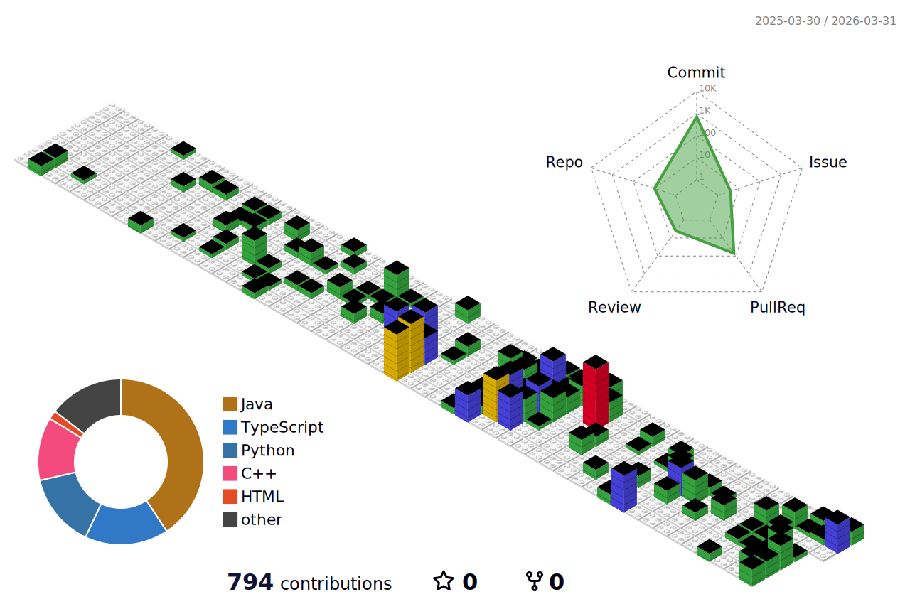
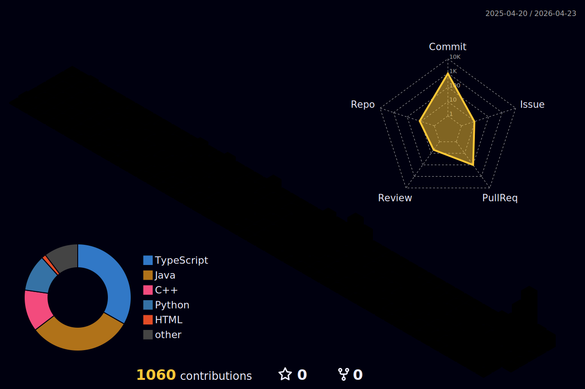

<!--  -->
<!--  -->
# 👋 Web-oriented Student Developer

웹 관련 개발 및 협업 경험을 쌓고 있습니다.

---

##  Activities

### Beautiq - AI 피부 분석 및 메이크업 시뮬레이션 서비스
- 기간: 2025.06 – 2025.11
- 역할: 서비스 2팀 Backend 파트장
- 비고: 빅데이터 분석 학회 D&A | 인공지능 학회 X:AI | 웹 학술 동아리 WINK 공동 컨퍼런스 프로젝트
- 사용 기술 : Spring Boot

🔗 [https://github.com/D-X-W-Beautiq](https://github.com/D-X-W-Beautiq)

---

### Crawlimmer - 크롤링 사이트 등록 및 갱신 알림 관리 앱
- 기간: 2025.10 – 2025.11
- 역할: Frontend + Backend
- 비고: 정규 교과목 '모바일 프로그래밍'수업 내 프로젝트 활동
- 사용 기술 : Android Studio(Java), FastAPI
  
🔗 [https://github.com/2025-2-2-6](https://github.com/2025-2-2-6)

---

